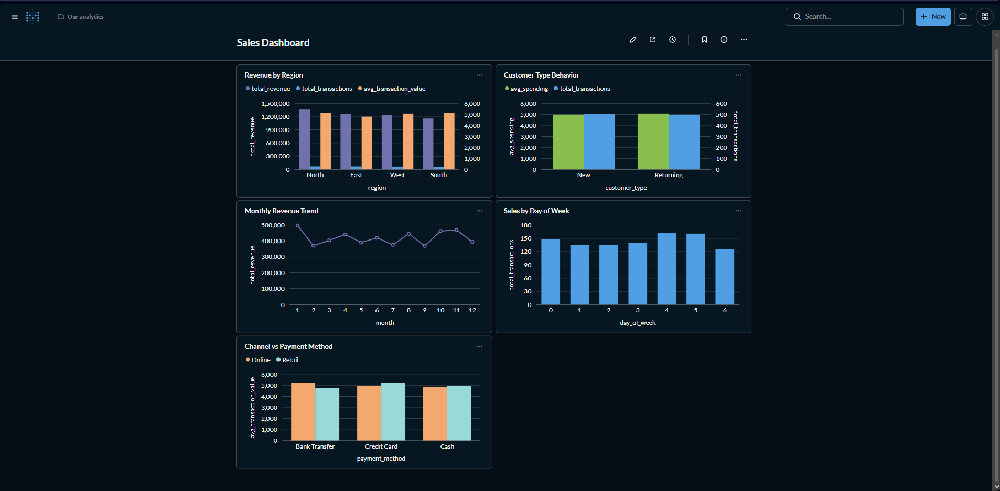

# Sales Analytics Pipeline

An end-to-end data analytics project built with Python, PostgreSQL, and Metabase.

## Project Overview
This project demonstrates a complete analytics pipeline:
1. Data cleaning with Python & pandas
2. Loading data into PostgreSQL
3. Writing analytics queries in SQL
4. Building a dashboard in Metabase

## Tech Stack
- Python (pandas, sqlalchemy)
- PostgreSQL
- Metabase
- SQL

## Analytics Questions Answered
1. Which region generates the highest revenue and transactions?
2. Does discount level impact profit?
3. Do returning customers spend more than new customers?
4. Which month and day of week drives the most sales?
5. Which sales channel and payment method combination performs best?

## Dashboard Preview

## Dataset
Randomly generated sales dataset with 1000 transactions covering 2023.
